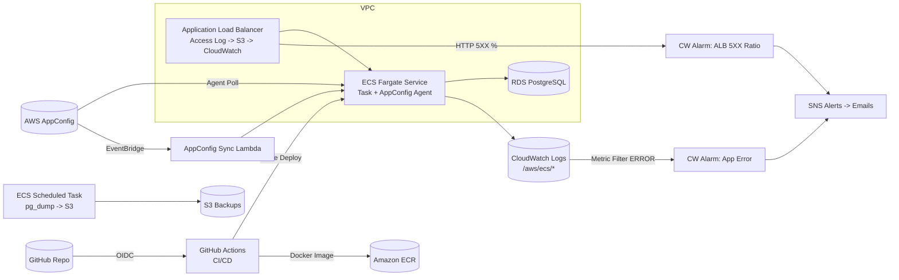

# POPER DevOps 交付文档

## 1. 项目概览

- **应用**：Laravel 11 / PHP 8.4，容器化并运行在 Amazon ECS (Fargate)。
- **托管区域**：`ap-northeast-1`（东京）。
- **基础设施**：使用 Terraform 管理（目录 `infra/terraform`），包括 VPC、ECS、ALB、RDS、AppConfig、日志/告警等。
- **CI/CD**：GitHub Actions（`.github/workflows/cicd.yml`）负责测试、构建镜像、推送到 ECR，并触发 ECS 滚动发布。
- **配置与变更**：AWS AppConfig 作为运行时配置源，通过 sidecar agent + Lambda 事件保持 ECS 配置实时同步。

## 2. 架构图



> **截图/图片**：若需要实际图片，可将上图（或 AWS Architecture Icons 绘制图）导出为 PNG 并附在提交包内。

## 3. 需求对照

| 模块 | 条款 | 状态 | 说明 / 证据 |
| --- | --- | --- | --- |
| PHP 部署 | #1 ECS(Fargate) 托管 Laravel | ✅ | `infra/terraform/ecs.tf`, `Dockerfile` |
|  | #2 首页打印环境变量 | ✅ | `src/routes/web.php`, `src/app/Services/AppConfigRepository.php` |
|  | #3 JSON 访问日志含 TraceId 并入 CloudWatch | ✅ | `src/app/Http/Middleware/RequestLoggingMiddleware.php` + awslogs |
|  | #4 PHP/PHP-FPM 日志入 CloudWatch | ⚠️ | 需改为 php-fpm 或额外日志采集策略（待办） |
|  | #5 ALB + Access Log -> CloudWatch | ✅* | 已在控制台配置，后续可将 S3 + Lambda (`infra/lambda/alb_logs_to_cw`) 纳入 IaC |
|  | #6 定时扩缩容 | ✅ | `aws_appautoscaling_scheduled_action` |
|  | #7 RDS + pg_dump 备份 | ✅ | `infra/terraform/rds.tf`, `infra/terraform/backup.tf` |
| CI/CD | #1 main push 触发 release | ✅ | `.github/workflows/cicd.yml` + `softprops/action-gh-release` |
|  | #2 构建镜像推送 ECR | ✅ | 同 workflow |
|  | #3 最新镜像部署 ECS | ✅ | `aws ecs update-service --force-new-deployment` |
|  | #4 成功/失败通知 | ✅ | SNS 邮件 |
| 环境变量 & AppConfig | #1 配置交付至 ECS | ✅ | AppConfig + agent + repository 读取 |
|  | #2 Release 后自动同步 | ✅ | AppConfig 事件 -> `appconfig_sync` Lambda -> `ecs.update_service` |
|  | #3 Release 通知 | ✅ | Lambda 发布 SNS |
| 日志/监控/告警 | #1 全量日志收集 | ✅ | 应用/VPC/备份日志 + ALB Access Log*(手动) |
|  | #2 ECS 指标 Dashboard | ✅* | 控制台手动创建（建议未来 IaC 化） |
|  | #3 ALB HTTP 状态 Dashboard | ✅* | 控制台手动创建 |
|  | #4 日志 ERROR 告警 | ✅ | `infra/terraform/monitoring.tf` log metric filter + alarm |
|  | #5 ALB 500 >10% 告警 | ✅ | `infra/terraform/monitoring.tf` metric math alarm |
| 文档 | #1 架构图 | ✅ | 本文档第 2 节（可另行导出 PNG） |
|  | #2 核心操作流程 | ✅ | 见第 4~7 节 |
| 提交包 | GitHub 仓库、AWS 链接、告警截图 | ⚠️ | 需在交付时补齐链接+截图（第 8 节占位） |

> 带 `*` 的条目当前在控制台手动完成，建议未来写入 Terraform（`alb`/`monitoring` 模块）以保持环境一致性。

## 4. 基础设施操作流程

1. **初始化**  
   ```bash
   cd infra/terraform
   terraform init
   ```
2. **规划/审查**  
   ```bash
   terraform plan -var-file="terraform.tfvars"
   ```
3. **部署**  
   ```bash
   terraform apply -var-file="terraform.tfvars"
   ```
4. **输出**  
   `terraform output` 可获取常用信息（ALB DNS、ECR 仓库、ECS 服务名、AppConfig IDs 等）。  
5. **注意事项**  
   - `terraform.tfvars` 中的 `app_key`、数据库凭据、S3 bucket 名称需按账户实际值更新。  
   - 如果 ALB Access Log、Dashboard 需要 IaC 化，可在 `infra/terraform` 新增 S3 + Lambda + CloudWatch Dashboard 配置。  

## 5. 应用发布流程（CI/CD）

1. **开发者提交**到 `main`：触发 GitHub Actions。
2. **Workflow 阶段**：
   - 安装 PHP 依赖、生成 `.env`、运行 `php artisan test`。
   - 通过 OIDC AssumeRole 登录 AWS、登录 ECR。
   - 构建 Docker 镜像，打上 `latest` + `SHORT_SHA` 双 tag，并推送。
   - 调用 `aws ecs update-service --force-new-deployment`，强制任务拉取最新镜像。
   - 创建 GitHub Release，成功/失败分别 SNS 邮件通知。
3. **回滚**：可通过 GitHub Release 选择旧版本 tag 并重新部署，或在 Terraform 中指定 `app_image` 固定镜像 URI 后 `ecs.update_service`。

## 6. AppConfig & 运行时配置

1. **配置位置**：`infra/appconfig/config.json`（初始值）或 AWS AppConfig 控制台。
2. **生效路径**：
   - AppConfig Hosted Config → AppConfig Agent sidecar → Laravel `AppConfigRepository` 读取 `homepage_env` / `feature_message`。
   - AppConfig 新版本发布 → 触发 EventBridge 事件 → `appconfig_sync` Lambda → `ecs.update_service` -> ECS 滚动替换任务。
3. **操作步骤**：
   - 在 AppConfig 中新增配置版本，选择现有 Deployment Strategy。
   - 发布时填写推出目标（environment），观察 Lambda 日志/SNS 通知确认同步成功。
   - 如需强制刷新，可在 ECS 服务上手动 “Force New Deployment”。

## 7. 监控 & 告警

| 类型 | 位置 | 说明 |
| --- | --- | --- |
| CloudWatch Logs | `/aws/ecs/<project>-app`、`/aws/ecs/<project>-backup`、`/aws/vpc/<project>-flow` | 应用、备份任务、VPC 流日志 |
| Log Metric Filter | `${local.name_prefix}-app-error-filter` | 匹配日志中的 `ERROR` 字符串 |
| Alarm - App Error | `${local.name_prefix}-app-error` | 60s 内出现 ERROR 即触发，通知 SNS |
| Alarm - ALB 5XX Ratio | `${local.name_prefix}-alb-5xx-ratio` | `HTTPCode_ELB_5XX_Count / RequestCount > 10%` 时告警 |
| Dashboard | *控制台手动创建* | 包含 ECS CPU/Mem、ALB HTTP 状态等图表 |
| ALB Access Log | *控制台手动创建* | ALB -> S3 -> Lambda (`infra/lambda/alb_logs_to_cw`) 将日志写入 CloudWatch |

> 告警邮箱：`te.qi+<name>@poper.co`, `hu.zhangjie+<name>@poper.co` 等，详见 `terraform.tfvars`。

## 8. 链接与截图（交付时补充）

| 项目 | 链接 / 截图 |
| --- | --- |
| GitHub 仓库 | `[repo-url]` |
| Terraform State / S3 | `[state-bucket-url]` |
| ALB (Console) | `[ALB-link]` |
| ECS Service | `[ECS-link]` |
| ECR Repository | `[ECR-link]` |
| AppConfig Application | `[AppConfig-link]` |
| RDS 实例 | `[RDS-link]` |
| CloudWatch Dashboards | `[dashboard-link]` |
| 告警截图（App Error, ALB 5XX） | `[upload screenshot paths]` |
| ALB Access Log / Lambda 配置截图 | `[upload screenshot paths]` |

> 建议在交付压缩包/在线文档中，将以上链接替换为真实 URL，并附上触发告警的截图（例如故意打 ERROR 日志或模拟 5XX 请求）。

---

如需更多补充（例如 ALB Access Log IaC 化、PHP-FPM 日志方案、或附加的运行手册），可在此文档后续章节继续扩展。祝交付顺利！
